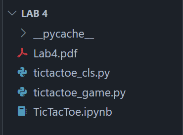
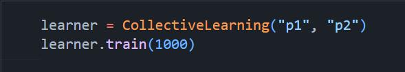
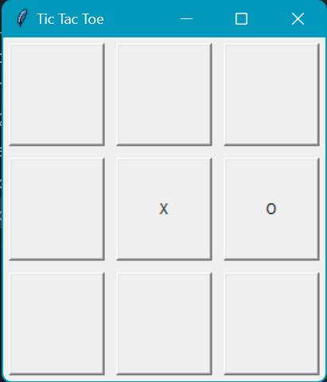
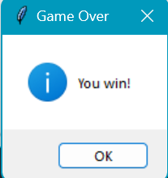

### Instruction (python <= 3.11.5)

1. Make sure **"tictactoe_cls.py"**, **"tictactoe_game.py"** and **"TicTacToe.ipynb"** is available in the same folder.

2. Run the program by pressing **"Run All"**. This will import and run any necessary function to implement TicTacToe gameplay logic, Collective learning scheme for unsupervised training, and the UI for human-AI gameplay.
    - You can edit the number of training epochs by editing the argument in the first code block under **Main** section

    

    - The game is currently set up so that human is the first player.

3. When the TicTacToe UI "Tic Tac Toe" pops up, click on a cell to make the first move. The AI agent will play after you do.

4. After the game ends, press OK to reset the board and start new game or press exit 'X' buttons to close all UIs and end program.
    - There are 3 endgame results: "You win", "AI wins", or "Tie!".
    
    
    
